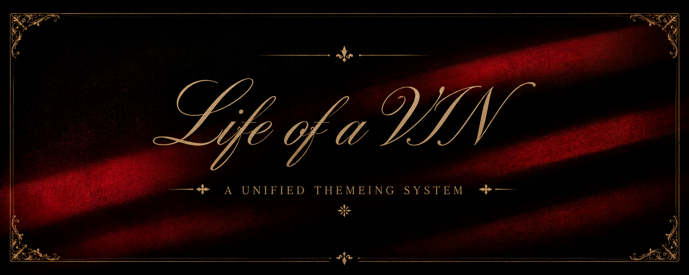

  

# Life of a VIN Unified Theme System

Life of a VIN is a luxury gothic theme system for websites, apps, terminals,
and interface kits. It uses black velvet surfaces, deep crimson atmosphere,
antique gold linework, cream serif typography, hard-edged frames, and
ceremonial UI details.

The first platform kit is HTML/CSS. Future folders can map the same token set
into other systems such as Android Material, iOS, Tailwind, Figma variables, or
design-token pipelines.

## Folders

| Path | Purpose |
| --- | --- |
| `Tokens/life-of-a-vin.json` | Platform-neutral theme contract. Start here when creating another platform target. |
| `Style Guide/` | Ongoing design sheet for the Life of a DON/Life of a VIN mood, palette, rules, and motif analysis. |
| `HTML CSS/` | Drop-in HTML/CSS implementation for websites and static prototypes. |
| `Android Material/` | Material 3 Android theme starter for Compose and XML/View apps. |
| `Linux/` | IceWM desktop themes with modern CrystalBlue-derived and classic icedesert-derived variants. |
| `Terminal/` | Terminal color schemes for Windows Terminal, WezTerm, and Alacritty. |
| `Images/Concepts/` | Concept references for the theme direction. |

## Current Kit

The HTML/CSS kit includes:

- `life-of-a-vin.css`: scoped drop-in CSS with tokens and components.
- `.lov-theme--don`: a variant class that leans harder into the album mood.
- `example.html`: self-contained demo page that can be opened directly.
- `assets/life-of-a-vin/`: background asset for the crimson shadow treatment.

Additional kits include Android Material resources for app interfaces and
terminal palettes for developer environments. The Linux kit includes drop-in
IceWM themes under `Linux/icewm/themes/`.

## Source Notes

The system is inspired by the luxury gothic mood of Don Toliver's Life of a DON
era, but it does not ship album artwork, artist imagery, logos, copied lyrics,
or other third-party IP.
